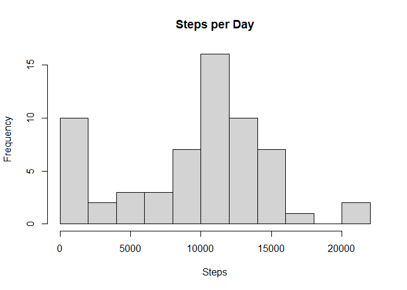
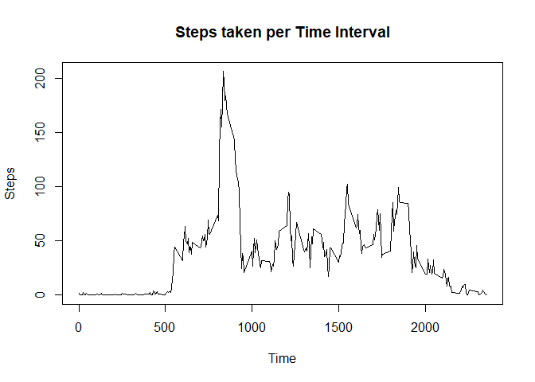
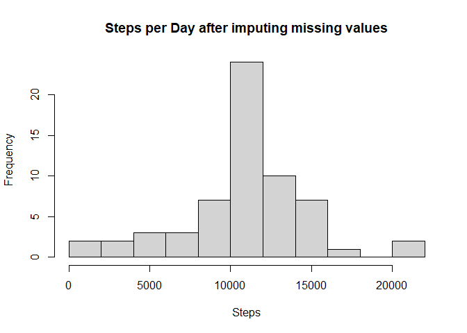
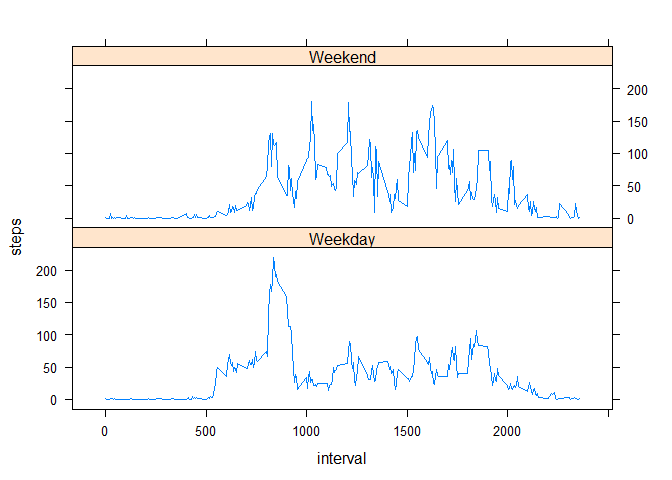

## Loading and preprocessing the data


```r
library(dplyr)
data <- read.csv('activity/activity.csv')
data$date <- as.Date(data$date,'%Y-%m-%d')
```

## What is mean total number of steps taken per day?
Total steps per day are calculated by grouping data by *date* and adding all 
steps on that day.


```r
steps_per_day <- group_by(data,date) %>%
    summarise(sum(steps, na.rm = TRUE)) %>%
    rename(steps = `sum(steps, na.rm = TRUE)`)

hist(steps_per_day$steps, xlab = 'Steps', breaks = 10, main = 'Steps per Day')
```

<!-- -->
  
#### Mean and Median of total number of steps taken per day :

```r
# Mean
mean(steps_per_day$steps)
```

```
## [1] 9354.23
```

```r
# Median
median(steps_per_day$steps)
```

```
## [1] 10395
```

## What is the average daily activity pattern?

Average daily activity pattern is calculated by grouping data by *interval* and 
averaging over all steps on that interval.

```r
steps_per_timeInterval <- group_by(data,interval) %>%
    summarise(mean(steps,na.rm = TRUE)) %>%
    rename(steps = `mean(steps, na.rm = TRUE)`)
plot(steps_per_timeInterval$interval, steps_per_timeInterval$steps,type = 'l',
     xlab = 'Time', ylab = 'Steps', main = 'Steps taken per Time Interval')
```

<!-- -->
  
### Interval with max no of average steps :

```r
max <- steps_per_timeInterval[which.max(steps_per_timeInterval$steps),][[1]]
```
This shows the person is most active during *835* interval.

## Imputing missing values
Missing values are handled by filling them with mean for their respective 
5-minute interval. 


```r
missing_values <- sum(is.na(data))
idx <- which(is.na(data))

data_new <- data
for (i in idx) {
    data_new[i,1] <- filter(steps_per_timeInterval, interval == data_new[i,3])$steps
}

steps_per_day_new <- group_by(data_new,date) %>%
    summarise(sum(steps, na.rm = TRUE)) %>%
    rename(steps = `sum(steps, na.rm = TRUE)`)
hist(steps_per_day_new$steps, xlab = 'Steps', breaks = 10,
     main = 'Steps per Day after imputing missing values')
```

<!-- -->
  
### Mean and Median of total number of steps taken per day (after mputing missing values) :

```r
# Mean
mean(steps_per_day_new$steps)
```

```
## [1] 10766.19
```

```r
# Median
median(steps_per_day_new$steps)
```

```
## [1] 10766.19
```
It can be seen from the histogram that both  new mean and median have same value which is higher than the previous one.

## Are there differences in activity patterns between weekdays and weekends?
New column is made which indicates whether the day is *weekday* or *weekend* day. Then the data is split using this and graph is plot by averaging over steps.


```r
library(lattice)
data_new <- mutate(data_new, day = as.factor
             (ifelse(weekdays(date) == 'Sunday', "Weekend","Weekday")))
steps_per_timeInterval_by_day <- group_by(data_new,interval,day) %>%
    summarise(mean(steps)) %>%
    rename(steps = `mean(steps)`)
xyplot(steps~interval | day, steps_per_timeInterval_by_day,
       type = 'l', layout = c(1,2))
```

<!-- -->
  
This shows that in general person is active for mote time during weekends.

